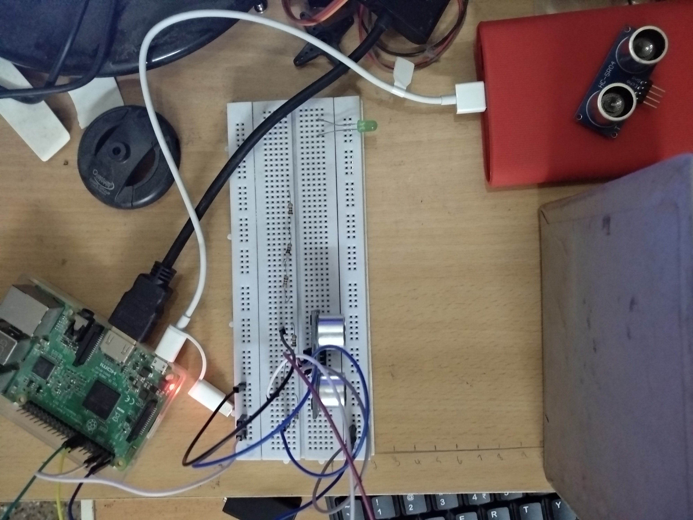
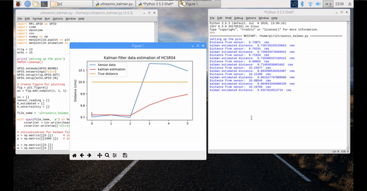

# Kalman-estimation-of-ultrasonic-sensor
This repository explains the design and implementation of kalman filters for distance estimation of ultrasonic sensor. The implementation follows the paper 'Kalman Filter Algorithm Design for HC-SR04 Ultrasonic Sensor Data Acquisition System'. 

The sensor used is HC-SR04 ultrasonic distance sensor. To know more about the working and usage of this sensor, check out: https://www.youtube.com/watch?v=Z-j08CbcHPA 

The setup 

Implementation

